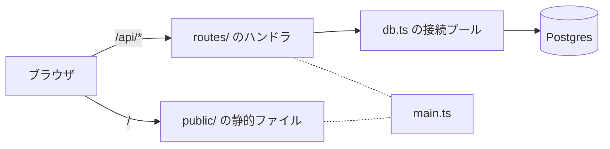

# メモ帳 (Deno Deploy スターター)

Deno Deploy 上で動く Web アプリのスターターテンプレートです。
ブラウザから使えるメモ帳が最初から動きます。 中身は Deno.serve の REST API と Postgres
で、ここを土台に自分のアプリへ作り替えていきます。

前提知識は Web 中級 (HTML / CSS / JavaScript と fetch が分かる) と、SQL は最低限 (`select` と
`insert` が読める) です。 Postgres も Deno Deploy も初めてで構いません。

## 何が入っているか

```
main.ts              サーバの入口。URL とハンドラの対応を書く場所
db.ts                DB への接続と query()。基本は触りません
routes/http.ts       レスポンスの組み立てと入力チェックの補助
routes/memos.ts      メモの CRUD。API を増やすときのお手本
migrations/          テーブル定義の履歴 (SQL)
public/              ブラウザに返す HTML / CSS / JS
compose.yml          ローカル開発用の Postgres
deno.json            タスクと依存の宣言
CLAUDE.md            Claude Code 向けの前提。消さないでください
```

Deno 以外のインストールは要りません。 依存は `deno.json` の `imports`
に書いてあり、初回実行時に自動で取得されます。

## 動く仕組み



`main.ts` が受けたリクエストのうち、`/api/` で始まるものは `routes/` のハンドラへ、それ以外は
`public/` の静的ファイルとして返されます。

## ローカルで動かす

Docker Desktop または Rancher Desktop が必要です。 用意できない場合は、次の節の「Deploy
上だけで開発する」に進んでください。

1. Postgres を起動します。

   ```sh
   docker compose up -d
   ```

2. 接続情報を環境変数に入れます。
   ターミナルを開き直すたびに必要なので、シェルの起動ファイルに書いても構いません。

   ```sh
   export PGHOST=localhost PGPORT=5432 PGUSER=app PGPASSWORD=app PGDATABASE=app
   ```

3. テーブルを作ります。

   ```sh
   deno task migrate
   ```

4. サーバを起動します。

   ```sh
   deno task dev
   ```

<http://localhost:8000/> を開くとメモ帳が表示されます。 `public/`
を編集したらブラウザを再読み込みするだけで反映されます。 `main.ts` や `routes/` を編集した場合は
`deno task dev` が自動で再起動します。

### Deploy 上だけで開発する

ローカルに Postgres を用意しない選択もできます。 ブランチを push すると、そのブランチ専用の URL と
DB が自動で作られるためです。 `git push` してから、Deploy の画面に出る Git Branch の URL
を開いて確認します。

反映までに毎回ビルドの待ち時間が入るので、動かせるならローカルの方が速く回せます。

## Deno Deploy にデプロイする

作業は <https://console.deno.com> で行います。 `dash.deno.com`
は停止済みの旧サービスなので、間違えて開かないでください。

### 1. アプリを作る

1. console.deno.com を開き、組織 (organization) を作ります。 組織の名前と slug
   は後から変更できません。
2. 組織のページで `+ New App` を押し、このリポジトリを選びます。 一覧に出てこない場合は
   `Configure GitHub App permissions` から対象リポジトリへのアクセスを許可します。
3. ビルドの設定を次のように入れます。
   - Install command: `deno install`
   - Build command: 空のまま (このテンプレートにビルド工程はありません)
   - Dynamic Entrypoint: `main.ts`

### 2. DB を用意してアプリに割り当てる

1. 組織のページの `Provision Database` から Postgres を作ります。
2. 作った DB をこのアプリに割り当てます (assign)。

割り当てると、環境ごとに別々の DB が用意されます。 本番は `{app-id}-production`、ブランチごとは
`{app-id}--{ブランチ名}`、プレビューは `{app-id}-preview` という名前になります。
本番のデータを壊さずにブランチで試せるのはこの仕組みのおかげです。

### 3. Pre-Deploy Command を設定する

アプリの設定で Pre-Deploy Command に次を入れます。

```
deno task migrate
```

Pre-Deploy Command は、ビルドが終わってから新しいバージョンが公開される直前に、環境ごとに 1
回だけ実行されます。 つまり `migrations/` に SQL を足して push すれば、その環境の DB
にだけ自動で適用されます。 手作業で `psql` をつなぐ必要はありません。

### 4. URL を確認する

デプロイが終わると、production の URL とブランチごとの URL が Deploy の画面に並びます。
審査に出すのは production の URL です。

まず `https://<あなたのURL>/api/health` を開いてください。 `{"ok":true,"db":"up"}`
が返れば、アプリも DB も正常です。 `db: "down"` なら DB の割り当てか Pre-Deploy Command
の設定を見直します。

## 接続情報を書かないこと

このリポジトリのどこにも DB のパスワードは書かれていません。 `db.ts`
は次のように、接続先を指定せずにプールを作っています。

```ts
export const pool = new Pool({ max: 3 });
```

Deno Deploy は `PGHOST` / `PGPORT` / `PGDATABASE` / `PGUSER` / `PGPASSWORD`
を環境変数として自動で注入し、`npm:pg` がそれを読みます。 だから `.env`
に接続文字列を書く手順は不要です。

逆に `new Pool({ host: "...", password: "..." })` と書いてしまうと、本番とブランチが同じ DB
を指すようになり、ブランチでの実験が本番のデータを壊します。 パスワードが GitHub
に残る問題もあります。 接続情報はコードに書かず、環境変数に任せてください。

## API

- `GET /api/health`: DB に届いているかを返します
- `GET /api/memos`: 一覧を新しい順に最大 100 件返します
- `GET /api/memos/:id`: 1 件返します
- `POST /api/memos`: 作成します。ボディは `{"title": "必須", "body": "省略可"}`
- `PATCH /api/memos/:id`: 更新します。渡したキーだけ書き換わります
- `DELETE /api/memos/:id`: 削除します

エラーは `{"error": "理由"}` の形で返ります。 ステータスコードは、入力の誤りが 400、対象が無ければ
404、サーバ側の不具合が 500 です。

`curl` で試すときはこうします。

```sh
curl http://localhost:8000/api/memos
curl -X POST -H 'content-type: application/json' \
  -d '{"title":"買い物","body":"牛乳"}' \
  http://localhost:8000/api/memos
```

## 自分の題材に作り替える

メモ帳を消して、自分のアプリにしてください。 順番はこの通りが楽です。

1. テーブルを決めます。 `deno task migrate:new create-posts` で `migrations/` に SQL
   ファイルが作られるので、`-- Up Migration` の下に `create table` を書きます。 `-- Down Migration`
   の下には元に戻す SQL を書きます。 一度 push
   したファイルは編集せず、変更は新しいファイルを足して表現します。
2. `routes/memos.ts` をコピーして、テーブル名と列名を置き換えます。 `Route[]` を export して
   `main.ts` の `routes` に並べれば、それで API が増えます。
3. `public/` を書き換えて画面を作ります。 `public/app.js` は fetch で API
   を叩いているだけなので、React などを使わずにここから広げられます。
4. 使わなくなった `memos` は、`migrations/` に `drop table` のマイグレーションを足して消します。

テーブルは 1 つか 2 つに収めるのがおすすめです。 1
週間で審査まで持っていくには、機能を絞って動くところまで作る方が有利です。

## つまずいたら

`/api/health` が `db: "down"` を返す。 DB がアプリに割り当てられていない可能性が高いです。 Deploy
の画面で DB の assign を確認してください。

テーブルが無いと言われる (`relation "memos" does not exist`)。 マイグレーションが走っていません。
ローカルなら `deno task migrate`、Deploy なら Pre-Deploy Command の設定を確認します。

ローカルで接続を拒否される。 `docker compose ps` でコンテナが up になっているか、`export PGHOST=...`
を実行したターミナルで作業しているかを確認します。

デプロイが warmup フェーズでタイムアウトする。 `deno.land/std` の古い `serve()` を使うと起こります。
`Deno.serve()` を使ってください。

原因が分からないとき。 Deploy の画面のログか、`deno deploy logs` でサーバ側のログを見ます。
`console.error` の出力はここに出ます。

## 参照

- Deno Deploy のドキュメント: <https://docs.deno.com/deploy/>
- `deno deploy` コマンド: <https://docs.deno.com/runtime/reference/cli/deploy.md>
- node-pg-migrate: <https://salsita.github.io/node-pg-migrate/>
- node-postgres (`npm:pg`): <https://node-postgres.com/>
